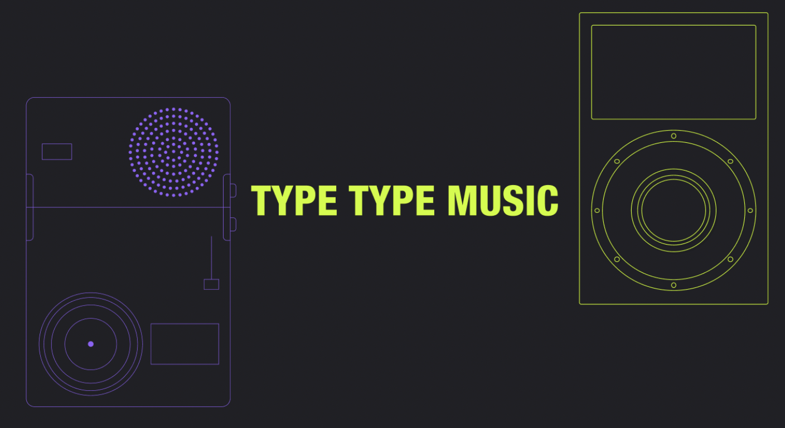
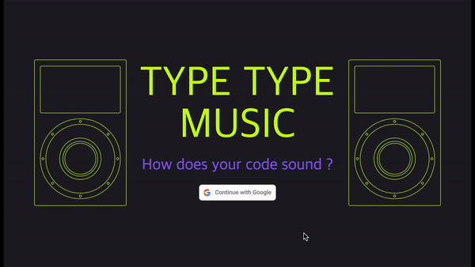
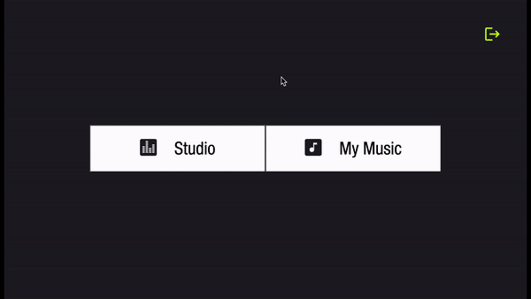
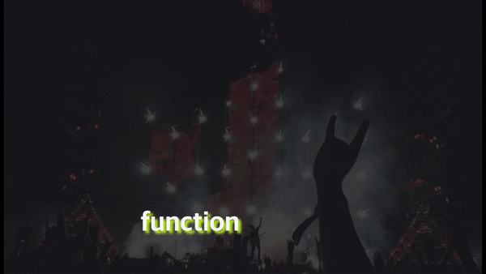
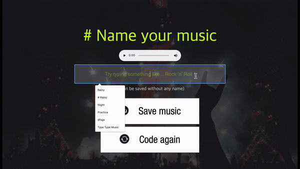

# <center>TYPE TYPE MUSIC</center>


<br />

### <center> 💡 아이디어를 떠올리게 된 계기... </center>

코딩을 하면서 컴퓨터 화면 속에 있는 코드들이 화면에 틀어박혀 있는 듯한 느낌을 받은 적이 있습니다. 코드는 아무런 소리를 내지 않기 때문이죠.

그러다 문득..! 코드들이 살아 움직여서 _✨**음악이 되어** 들어보는 상상을 하게 되었습니다✨_

과연 내가 짠 코드의 소리는 과연 **좋은 음악**😇 이 될까요 **나쁜 음악**👿 이 될까요?

<br/>

## 🛰 배포

```
- 프론트엔드
  - 웹사이트 배포: Netlify
- 백엔드
  - 웹사이트 배포: AWS EB (Elastic Beanstalk)
  - SSL 발급 및 관리: Amazon ACM (AWS Certificate Manager)
  - HTTPS Listener 생성: Elastic Load Balancing
```

> 배포 링크: https://joyful-druid-5ea444.netlify.app

<br/>

## 🕹 주요 기능

|                                                                              |                                                   |
| :--------------------------------------------------------------------------: | :-----------------------------------------------: |
|                                             |      |
|           구글 계정을 이용하여 로그인과 로그아웃을 할 수 있습니다            |  코드 에디터에 나만의 코드를 작성할 수 있습니다   |
|                                         |                  |
| 그동안 만든 녹음본들을 모아볼 수 있으며 좋아요를 누르거나 삭제할 수 있습니다 | 음악을 만드는데 사용된 코드들을 화면에 띄워줍니다 |
|                                                 |                                                   |
|                   작업한 녹음본에 이름을 붙일 수 있습니다                    |                                                   |

<br/>

## 📆 작업 기간

- **기획** : 1주차 (2022/06/27 ~ 2022/07/03)
  - 아이디어 구상 및 기술 스택 선택
- **개발** : 2, 3주차 (2022/07/04 ~ 2022/07/17)
  - 코드 작성 및 배포

<br/>

## ⚙️ 기술 스택

- 프론트엔드

  - `React`
  - `recoil`
  - `Tone.js`

- 백엔드

  - `Node.js`
  - `Express`
  - `MongoDB`

- 기타
  - Storage: `AWS S3 bucket`
  - Login: `firebase`, `firebase admin`

<br/>

## 💾 프로젝트 설치 및 실행 방법

- Frontend

```
git clone https://github.com/minjugg/type-type-music-frontend.git
npm install
npm run start
```

- Backend

```
git clone https://github.com/minjugg/type-type-music-backend.git
npm install
npm run nodemon
```

- Frontend & Backend 동시 실행 방법

```
각 위 두 가지 과정을 npm install 까지 실행한 후
cd ../type-type-music-frontend
npm run con
```

<br />

# 🎖 개발 챌린지

## 1. 💽 오디오 파일의 저장 및 변환

생성한 음악들을 모아서 나중에 들어볼 수 있게 하기 위해서 처음에는 단순히 `MongoDB`에 음악 파일을 저장하고 불러오기만 하면 될 것으로 생각했습니다. 그러나 `Tone.js`로 녹음한 오디오는 file이 아닌 **blob 형태**로 저장이 되며, 이를 서버에서 저장하려고 하니 동작이 되지 않았습니다. 이는 서버에서는 blob이 아닌 file 형태의 데이터만 받을 수가 있기 때문이었고 더군다나 blob은 짧은 새로고침을 할 때마다 값이 달라진다는 문제점이 발생해서 적절한 방식이 아니라는 것을 깨달았습니다.

이 문제점을 해결하기 위해 blob 형태의 오디오를 `File() 생성자`를 이용해 file 형태로 변환시킨 후, `AWS S3 버킷`에 저장하였고 버킷의 url주소를 `MongoDB`에 저장하였습니다. 음악을 불러올 때는 버킷의 url주소를 불러왔습니다.

<details>
  <summary>AWS S3 버킷을 사용한 이유?</summary>
  <div markdown="1">
단순히 몇 개의 오디오 파일만 사용하는 것이라면 문제가 되지 않겠지만 MongoDB에 저장할 수 있는 파일들은 16MB 용량 제한을 갖기 때문에 프로젝트의 확장성을 생각해 대안을 찾아야 했습니다. AWS S3 버킷을 사용하면 음악 저장을 무제한으로 할 수가 있으므로 더 많은 오디오 파일의 저장을 할 수 있는 버킷을 활용하는 방법을 찾을 수 있었습니다. 최종적으로 별도의 버킷에 음원 파일들을 모두 담아놓고 MongoDB에는 음원파일이 담긴 버킷의 url만 저장하는 것이 바람직하다는 결론을 내릴 수 있었습니다.
  </div>
</details>

## 2. 🙋🏻‍♂️ setInterval이 멈추는 지점

최종 녹음본을 들어보니 음악 소리가 흘러나오다가 중간에 뚝- 끊기는 현상이 발생했습니다. 소리 녹음을 시작하는 시점과 정지하는 시점을 정확하게 맞춰주지 않았기 때문에 생겨난 문제점이었습니다.

처음 작성한 코드에서는 setInterval이 호출된 후 1000ms가 지난 시점에 `recorder.stop()`을 해준 후, 이후 내부에 반복음을 발생시키는 객체인 sequence를 멈추는 로직을 구현했습니다. 이렇게 하면 sequence는 배열을 순환해서 반복하여 음을 발생시키는 객체이기 때문에, 마지막 음에 도달하더라도 녹음을 다시 처음 배열로 돌아가서 음악을 계속 발생시켰습니다. 그러다 도중 녹음이 중지되기 때문에 마무리가 어색하게 끝나는 것이었습니다.

음이 담긴 배열의 마지막에 도달하면 음악을 멈추게 하고, 이후 recorder를 중지시켜야지만 제가 원하는 결과를 얻어낼 수 있었습니다. 아래 코드로 해결을 할 수 있었습니다.

<details>
  <summary>작성 코드 보기</summary>
  <div markdown="1">

1. 수정 전

```
const sequence = new Tone.Sequence(
  async (time, note) => {
    if (noteIndex >= noteLength) {
      const endRecording = setInterval(async () => {
        const recording = await recorder.stop(); // 2. 녹음 중지

        sequence.stop(); // 3. 음악 중지

        return clearInterval(endRecording);
      }, 1000);
    },
    notes,
    "4n"
  );

  sequence.start(); // 1. 음악 시작
}, []);
```

2. 수정 후

```
const sequence = new Tone.Sequence(
  async (time, note) => {
    if (noteIndex >= noteLength) {
      const endRecording = setInterval(async () => {
        const recording = await recorder.stop(); // 3. 녹음 중지

        return clearInterval(endRecording);
      }, 1000);

      sequence.stop(); 2. 음악 중지
    },
    notes,
    "4n"
  );

  sequence.start(); // 1. 음악 시작
}, []);
```

  </div>
</details>
<br/>

## 3. 💻 프로그램 동작 운영체제 대응

배포한 후 음악 소리가 갑자기 들리지 않는 문제를 마주했습니다. 이는 Chrome 71부터 적용된 자동 음악 재생 방지 정책 때문이라는 것이었는데, 결론적으로는 유저가 놀라지 않도록 갑작스럽게 오디오 소리가 흘러나오는 것을 브라우저가 막은 것이었습니다.

해결 방법을 조사한 결과, 소리가 들리게 하기 위해서는 버튼 클릭, 스크롤과 같은 사용자 상호작용이 있어야 한다는 것을 알게 되었고, 이를 해결해주기 위해 버튼 클릭 시 재생이 되게끔 코드를 변경해줬습니다.

브라우저(Chrome, Safari, Firefox)마다 다른 정책들이 적용된다는 것을 처음 알게 되었습니다. 실제 유저가 다양한 브라우저를 사용할 수 있다는 가능성을 항상 생각하면서 코드 작성 이외에도 운영체제에 대한 대처를 해줘야 한다는 것을 새길 수 있었습니다.

<br />

# 😅 아쉬운 점

## 1. API 호출 시 selector의 캐싱 기능 사용의 부재

selector는 API를 한번 호출했다가 이후에 같은 값이 나오면 캐싱된 값을 불러오는 기능이 있습니다. selector의 이러한 기능을 사용하면 더 빠르게 화면을 보이게 할 수 있을 것 같아 적용해보았으나 리팩토링을 한 후, 원하는대로 화면이 바뀌지 않는 것을 볼 수 있었습니다.

이는 selector의 순수함수라는 특성 때문이었습니다. selector는 오직 구독하고 있는 atom의 변화에만 영향을 받으며, 제 코드는 `currentUser`를 구독하고 있었기 때문입니다. `currentUser`는 변하지 않으므로 API 호출이 일어나더라도 화면 상에는 아무런 변화가 나타나지 않았습니다.

이를 해결하기 위해서는 selector가 구독하고 있는 atom의 값을 `Date.now()`와 같이 매번 바뀌는 값으로 설정해주거나, `useRecoilRefresher_UNSTABLE()` 훅을 사용해서 강제로 selector의 캐시값을 지우는 방식이 있었습니다. 그러나 저의 프로젝트의 경우에는 오디오 데이터를 불러오는 경우가 My Page를 방문할 때 한번이었고, 페이지 이동이 많지 않은 곳이었기 때문에 큰 변화가 없어 더 이상 코드를 수정하지 않았습니다.

## 2. 음악 생성 로직

유저가 작성한 코드를 기반으로 음악을 생성할 때, 어떤 방식으로 음들을 조합할지에 대한 고민을 많이 했습니다. 아름다운 소리에 대한 기준을 정하는 것도 어려웠고, 음악 코드에 대한 지식도 매우 부족한 상태에서 음악을 다루는 것이 쉽지 않았습니다.

처음에는 단순히 키 하나에 음을 하나씩 매핑해서 듣는 방식으로 만들어줬습니다. 그러나 결과는 매우 처참했습니다... 매우 들쭉날쭉하고 규칙 없이 나는 소리는 불쾌감을 일으키는 소리를 만들어냈습니다. 결국 작곡법에 대한 공부를 했는데 이는 매우 복잡한 "창작의 영역"이라는 것을 알게 되었고, 점점 시간이 지날수록 정해진 기간 내 프로젝트를 완성시켜야 한다는 부담감이 쌓여갔습니다.

그 결과 **코드톤**을 기반으로 한 작곡법으로 음악 로직을 구상하기로 결정했습니다. 완벽하게 아름다운 선율 소리를 만들 수는 없었지만 한번 가공을 거친 소리가 이전보다 훨씬 듣기 편안해진 것을 느낄 수 있었습니다.

이외에도 비슷한 음계로만 연주되도록 하기, 그리고 옥타브를 조절하여 혼자 튀는 소리들이 나지 않게 하기 등의 방법으로 멜로디를 조율해줬습니다.

<details>
<summary>코드(Chord, 화음)톤 작곡법이란? 🎻</summary>
악보 마디마다 코드톤(A chord 등)을 지정해준 후 코드톤에 해당하는 음들로만 더 섬세하게 멜로디를 만들어내는 작곡법입니다. 하나의 글자는 하나의 코드톤에 해당하도록 짜고 그 코드톤에 해당하는 음들로 나머지 악보를 만들어줬습니다.
</details>

<br />

## 3. 테스트 코드 작성

정해진 프로젝트 기간 내에 테스트 케이스를 작성하지 못한 점 또한 아쉽습니다. 프로젝트 기간이 끝난 이후에도 지속해서 단위, E2E 테스트를 작성해서 안정적인 서비스를 만들 계획입니다.

<br />

# 🕌 마지막 소감

- 결정을 내려야 할 때 개인 프로젝트이다 보니 혼자 빠르게 결정하며 진행할 수 있었지만, 때론 다른 의견들이나 조언들도 필요할 때마다 협업의 소중함을 느끼기도 했습니다. 3주라는 기간 동안 기획, 코드 작성, 배포까지 모든 것을 혼자 하다 보니 굉장히 신경을 써야 할 부분들이 많다는 것을 느꼈고 그 혼자 해결해나가는 과정에서 개인적인 성장을 많이 이룰 수 있게 된 것 같습니다.

- 마지막으로 더 좋은 양질의 프로젝트를 만들어내기 위해 디자이너의 도움을 받았습니다. 덕분에 처음 디자인했던 것보다 훨씬 보기 좋은 프로젝트를 완성할 수 있게 되어 감사했습니다. _Thanks to 류동하(torstailuck@gmail.com)_.
