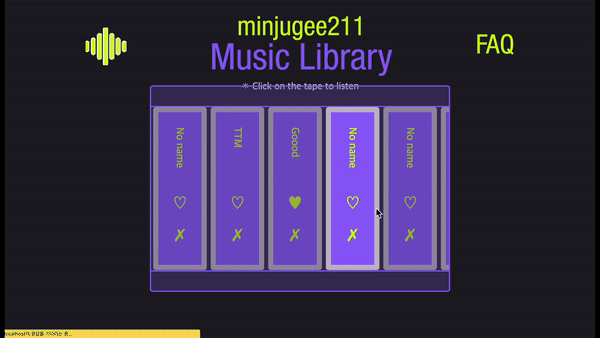

# <center>TYPE TYPE MUSIC</center>


<br />

### <center> 💡 아이디어를 떠올리게 된 계기... </center>

코딩을 하면서 컴퓨터 화면 속에 있는 코드들이 화면에 틀어박혀 있는 듯한 느낌을 받은 적이 있습니다. 코드는 아무런 소리를 내지 않기 때문이죠.

그러다 문득..! 코드들이 살아 움직여서 _✨**음악이 되어** 들어보는 상상을 하게 되었습니다✨_

코드를 컴퓨터 코드로만 볼 필요가 없다고 생각이 들자, 컴퓨터 코드가 꼭 **악보**와 같이 보이기 시작했고 둘은 공통점이 있다고 생각했습니다.

개발자가 짠 코드를 정해진 규칙으로 컴퓨터가 읽으면서 내려가듯이,

음악도 작곡가가 적은 코드에 따라 연주가 되기 때문입니다.

내가 짠 코드는 어떤 소리를 낼까요? 과연 **좋은 음악**😇이 될까요 **나쁜 음악**👿이 될까요?

# 🎞 프로젝트 자세히

## 🛰 배포

```
- 프론트엔드
  - 웹사이트 배포: Netlify
- 백엔드
  - 웹사이트 배포: AWS EB (Elastic Beanstalk)
  - SSL 발급 및 관리: Amazon ACM (AWS Certificate Manager)
  - HTTPS Listener 생성: Elastic Load Balancing
```

<br/>

### 🎧 코드 소리 들으러 가기

> 배포 링크: https://joyful-druid-5ea444.netlify.app

<br/>

## 🕹 주요 기능

|                                                                              |                                                   |
| :--------------------------------------------------------------------------: | :-----------------------------------------------: |
|                                             |      |
|           구글 계정을 이용하여 로그인과 로그아웃을 할 수 있습니다            |  코드 에디터에 나만의 코드를 작성할 수 있습니다   |
|                                         |                  |
| 그동안 만든 녹음본들을 모아볼 수 있으며 좋아요를 누르거나 삭제할 수 있습니다 | 음악을 만드는데 사용된 코드들을 화면의 띄워줍니다 |
|                                                 |                                                   |
|                   작업한 녹음본에 이름을 붙일 수 있습니다                    |                                                   |

## 📆 작업 기간

- **기획** : 1주차 (2022/06/27 ~ 2022/07/03)
  - 아이디어 구상 및 기술 스택 선택
- **개발** : 2, 3주차 (2022/07/04 ~ 2022/07/17)
  - 코드 작성 및 배포

<br/>

## ⚙️ 기술 스택

- 프론트엔드

  - `React`
  - `recoil`
  - `Tone.js`

- 백엔드

  - `Node`
  - `Express`
  - `MongoDB`

- 기타
  - Storage: `AWS S3 bucket`
  - Login: `firebase`

<br/>

## 💾 프로젝트 설치 및 실행 방법

- Frontend

```
git clone https://github.com/minjugg/type-type-music-frontend.git
npm install
npm run start
```

- Backend

```
git clone https://github.com/minjugg/type-type-music-backend.git
npm install
npm run nodemon
```

- Frontend & Backend 동시 실행 방법

```
각 위 두 가지 과정을 npm install 까지 실행한 후
cd ../type-type-music-frontend
npm run con
```

<br />

##

# 🎖 개발 챌린지

## 💽 오디오 파일의 저장 및 변환

생성한 음악들을 서버를 연결해 지속해서 들을 수 있도록 초기 기획하였습니다. 처음에는 단순히 음악 파일을 몽고디비에 저장을 하고, 이를 불러오기만 하면 될 줄 알았으나 Tone.js를 사용해 녹음한 오디오는 file이 아닌 blob형태로 저장이 되며, 짧은 지속시간마다 달라지는 문제점이 있었습니다. 이를 바로 서버에 저장하는 방법으로는 음악을 보관할 수 없었습니다.

이를 해결하기 위해 blob형태의 오디오를 file형태로 변환시킨 후, AWS S3 버킷에 저장하였고 버킷의 url주소를 MongoDB에 저장하였습니다. 음악을 불러올 때는 버킷의 url주소를 불러왔습니다.

### AWS S3 버킷을 사용한 이유?

단순히 몇개의 오디오 파일만 사용하는 것이라면 문제가 되지 않겠지만 음악 저장을 무제한으로 할 수가 있기 때문에 더 많은 오디오 파일의 저장을 위해 버킷에 저장하는 방법을 선택했습니다.

## 💻 프로그램 동작 운영체제 대응

배포를 한 후에 음악 소리가 들리지 않는 문제가 발생했습니다. 이는 Chrome 71부터 적용된 자동음악 재생 방지 정책 때문이었습니다.

Chrome 71 자동음악 재생 방지 정책은 사용자가 갑작스러운 소리에 놀라지 않도록 음소거가 된 상태를 제외했을 때 오디오 소리가 흘러나오지 않도록 브라우저에서 막아주는 것입니다. 자료조사를 한 결과, 소리가 들리게 하기 위해서는 사용자 상호작용이 있어야 한다는 것을 알게 되었고, 이를 해결해주기 위해 버튼 클릭 시 재생이 되게끔 코드를 추가해줬습니다.

브라우저(Chrome, Safari, Firefox)마다 상이한 정책들이 적용되기 때문에 코드 작성 이외에 다양한 브라우저에서 구동이 되게 하기 위해서는 별도로 대처를 해주어야 한다는 것을 배울 수 있었습니다.

## 🎵 음악 생성 로직

프로젝트를 진행하면서 가장 고민했던 부분은 어떻게 하면 조화로운 음악을 만들 수 있을지였습니다. 제가 작곡법에 대해 잘 알고 있는 상태가 아니었고, 음악전공생도 더더욱 아니었기에 듣기 좋은 음악을 만드는 것은 생각만큼 쉽지 않았습니다.
단순히 키 하나에 음을 하나씩 매핑해서 듣는다면, 절대 듣기 좋은 소리를 만들어낼 수가 없었기 때문입니다. 그래서 여러가지 작곡법을 알아보던 중, 코드(Chord, 화음)톤을 기반으로 한 작곡법으로 음악 로직을 구상하기로 결정했습니다.

이외에도 비슷한 음계로만 연주되도록 하기, 그리고 옥타브를 조절하여 혼자 튀는 소리들이 나지 않게 하기 등의 방법으로 멜로디를 조율해줬습니다.

<details>
<summary>코드톤 작곡법이란? 🎻</summary>
악보 마디마다 코드톤(A chord 등)을 지정해준 후 코드톤에 해당하는 음들로만 더 섬세하게 멜로디를 만들어내는 작곡법입니다. 하나의 글자는 하나의 코드톤에 해당하도록 짜고 그 코드톤에 해당하는 음들로 나머지 악보를 만들어줬습니다.
</details>
<br />

# 🕌 소감

기획부터 코드 작성, 배포, 테스트 코드까지 오롯이 혼자서 결정한 프로젝트였습니다. 다행히 디자인은 좋은 디자이너분을 만나 여러 회의 끝에 제가 원하는 컨셉으로 프로젝트를 만들어낼 수 있었지만 디자이너분의 도움이 없었다면 지금의 프로젝트를 만들어내기에는 정말 어려웠을 것이라는 생각이 듭니다.

팀프로젝트할 때 당시가 많이 떠오로는 프로젝트였습니다. 팀프로젝트를 할 당시에는 항상 상의를 거쳐서 최종 결정을 했기 때문에 이 과정에서 꽤 오랜 시간이 소모된다고 생각했는데, 개인 프로젝트에서는 오히려 그런 과정이 없는 것이 더 힘들게 다가왔습니다. 사소하게 변수명을 정할 때도 어떤 단어가 더 가독성이 좋게 느껴지는 지, 더 문맥이 통하는 지 의견을 구할 팀원이 없어 더 많은 시간과 노력을 들여야 했고 심지어 배경화면, 버튼 색상 하나하나 혼자 고민하는 시간을 가질 때마다 팀원의 소중함을 체감할 수 있었습니다. 하나의 프로젝트를 만들 때에는 팀원, 멘토, 디자이너 많은 분들이 모였을 때 가장 좋은 프로젝트를 만들 수 있다는 것을 느꼈습니다.

이를 통해 나중에 팀으로 현업에서 일을 하게 되면 팀원들과 다 같이 의사결정을 내리는 과정이 얼마나 효율적인 것인지를 느끼면서 작업할 수 있게 될 것 같습니다.
